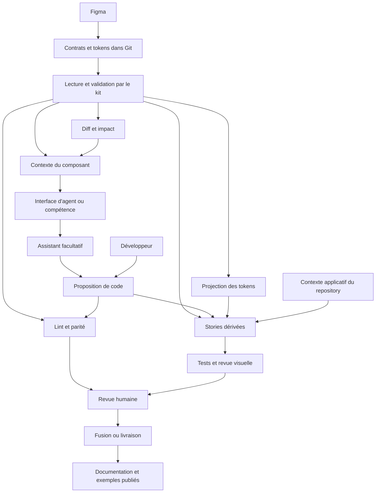

# Pistes d’évolution

Ce document rassemble ce qui n’est **pas** décidé : le positionnement du modèle
dans son écosystème, les options ouvertes, les risques qui les motivent, et un
point de vue sur la direction générale. Il ne décrit ni le comportement actuel,
défini dans [docs/FORMAT.md](../FORMAT.md) et
[packages/plugin/SPEC.md](../../packages/plugin/SPEC.md), ni les priorités
engagées, suivies dans [ROADMAP.md](../../ROADMAP.md), ni les principes du
modèle, posés dans [CONCEPT.md](../../CONCEPT.md).

Règle d’admission, valable pour tout ce qui suit : une option n’entre dans la
spécification qu’après **un besoin observé sur un composant réel**, **un
propriétaire clair dans le modèle** et **un plan de validation côté
consommateur**. Une évolution améliore la robustesse ou la confiance sur un cas
vu, sans créer une nouvelle source de vérité.

L'étude de la [pipeline modulaire](#8-pipeline-modulaire-autour-des-contrats)
détaille les intégrations envisagées : tokens, linter, Storybook, Chromatic,
documentation zeroheight, diff sémantique, lecture par un agent, assistant
d'implémentation et orchestration. Elle distingue les capacités documentées des
outils, les propositions UCM et les essais nécessaires avant de les adopter.
Elle confronte aussi la construction à l'achat d'une plateforme intégrée, nomme
la panne silencieuse de chaque module et donne la grandeur qui ferait renoncer à
chacun.

---

## 1. Positionnement

Le problème traité est largement reconnu ; les solutions existantes n’en
couvrent chacune qu’une part.

| Solution ou standard | Ce qu’elle apporte | Différence avec l’UCM |
|---|---|---|
| [Figma Code Connect](https://help.figma.com/hc/en-us/articles/23920389749655-Code-Connect) | Relie composants Figma et code réel, mappe les propriétés, enrichit le contexte servi aux agents par Figma | Le mapping et les exemples restent dans l’écosystème Figma ; l’UCM produit une spécification autonome, versionnée dans le repository et lisible sans accès à Figma |
| [Storybook](https://storybook.js.org/docs/8/writing-docs/autodocs) | Documente les composants depuis le code, les stories et les métadonnées de props | La source y est le code ; Storybook n’extrait ni la vérité visuelle ni les règles Figma |
| [UXPin Merge](https://www.uxpin.com/docs/merge/merge-design-system-documentation/) | Fait concevoir avec les composants codés réels | Approche code-first ; l’UCM maintient deux responsabilités distinctes et reliées |
| [Backlight](https://backlight.dev/docs/make-your-first-design-system) | Réunit source, stories, tests, doc et ressources design | La co-localisation est proche, sans contrat structuré exporté depuis Figma ni conçu pour des agents |
| [DTCG](https://tr.designtokens.org/format/) | Standardise l’échange des tokens entre outils | Couvre les tokens, pas la spécification d’un composant ; l’UCM l’utilise plutôt qu’il ne le concurrence |

Aucun de ces ingrédients n’est neuf isolément. La différenciation tient à leur
combinaison : extraction déterministe depuis Figma, contrat générique par
composant, co-localisé avec le code, réunissant variantes exactes, états,
tokens, icônes, composition et règles d’usage, exploitable sans Figma par un
humain, une CI ou un agent, et éprouvé par un test en contexte froid.

Le positionnement juste est celui d’une **couche de contrat design, Git-native
et lisible par les agents, posée à côté du code réel**. Elle complète Code
Connect, Storybook et DTCG ; elle ne les remplace pas.

**Où le gain est réel** : équipes disposant à la fois d’un design system Figma
et d’une bibliothèque de composants, travaillant avec plusieurs agents ou
environnements assistés, tenant à la traçabilité Git, partageant un design
system entre plusieurs frameworks, ou constatant des divergences de nommage
entre Figma, la documentation et le code.

**Où il est faible** : petite bibliothèque peu structurée, design system
entièrement code-first, ou organisation déjà engagée dans un outil où les
composants codés servent directement à concevoir.

---

## 2. Options ouvertes : le contrat portable

### Manifeste d’icônes

Une prop d’icône modifiable n’énonce pas les noms acceptés par le kit de
l’application. Un manifeste séparé pourrait associer nom Figma et identifiant de
code, sans faire du catalogue d’icônes un détail interne de chaque contrat.

*À ouvrir si* un test froid doit inventer un nom d’icône. Il faudra alors dire
qui publie le manifeste, comment il est versionné, et comment le consommateur
valide une référence.

### Propriétés visuelles supplémentaires

`textCase` et `textDecoration` sont les premiers candidats connus. Une propriété
n’est ajoutée qu’avec : le calque qui en est propriétaire, sa forme portable,
son applicabilité et ses valeurs neutres, le comportement en liaison partielle
ou `figma.mixed`, un diagnostic designer et un test de consommation.

L’arbre actuel reste l’unique autorité pour décider qu’un calque est publié. Une
extension ne recopie pas l’arbre Figma et n’ouvre pas les tracés d’une icône.

### Localisation structurée des diagnostics

Le type prévoit une localisation facultative (`figma.variantName`,
`figma.nodeName`, `figma.nodeId`, `figma.property`, `contractPath`) que l’export
ne renseigne pas. L’alimenter permettrait de corréler une propriété absente avec
le diagnostic qui l’explique.

*Condition* : un collecteur typé partagé par tous les extracteurs. Quelques
localisations isolées donneraient une carte trompeuse.

### Un canal de débogage dans le plugin

Le plugin n’a plus de journal. Celui qui existait redisait le compte rendu,
ligne pour ligne, et coûtait un dépliant permanent qu’il fallait ouvrir pour
découvrir qu’il ne contenait rien de neuf.

Ce qui manquerait vraiment est ce que le compte rendu ne dit pas : l’ordre exact
des appels Figma, leur durée, ce qu’une étape a lu. Cela ne se remet pas dans
une fenêtre de 380 px par précaution.

*À ouvrir quand* un défaut réel aura montré ce qu’il fallait voir pour le
comprendre. Le canal se décide alors avec sa règle, et la règle vient du défaut.

### Compatibilité et interopérabilité

Le JSON Schema est publié et dérivé de `types.ts`, et la politique de
compatibilité l’accompagne dans [COMPATIBILITE.md](../COMPATIBILITE.md). Ce
qu’elle laisse ouvert : `tokens.json` n’a pas de version propre, et n’en recevra
une qu’au premier changement de sa grammaire de projection.

Une porte de CI fondée sur ce schéma a été examinée puis écartée : le
consommateur prouve déjà la forme, et une seconde autorité sur la même
convention finit par accepter ce que la première refuse. Elle ne se rouvrira que
pour un consommateur hors Node.

### Distribution du plugin, et le lien vers Figma qui en dépend

**Tranché : le plugin se distribue par la Figma Community.**
`enablePrivatePluginApi` est retiré du manifest, `figma.fileKey` n'arrive donc
plus, et `meta.figma.url` n'est plus écrit. Ce qui suit garde les termes de
l'arbitrage, la décision se relit mieux à côté de ce qu'elle a écarté.

Le manifest déclarait `enablePrivatePluginApi`, réservé aux plugins privés d'une
organisation. Un seul appel en dépendait : `figma.fileKey`, qui alimentait
`meta.figma.url`, le lien direct vers le composant source
(`packages/plugin/src/contract/exportComponent.ts`). Une publication publique
sur la Community suppose de retirer ce drapeau, et le choix de distribution
décide donc du contenu des contrats.

**Rester plugin privé d'organisation.** Le contrat garde `meta.figma.url`, et
une revue de pull request ouvre le composant source d'un clic. La distribution
se limite en revanche aux membres de l'organisation Figma : personne d'autre ne
peut installer le plugin, donc personne d'autre ne peut produire de contrat.

**Publier sur la Community.** Le plugin s'installe sans restriction, et tout
designer produit alors des contrats. `figma.fileKey` devient indisponible :
`meta.figma.url` disparaît, et la traçabilité repose sur `fileName` et `nodeId`,
que le contrat conserve. L'export n'est pas bloqué et aucune information de
rendu n'est perdue : ce qui tombe est un raccourci de navigation, pas une donnée
du design. Reconstituer le lien à la main reste possible pour qui connaît la clé
du fichier.

**Ce que la décision a coûté, et ce qu'elle a rendu.** Le point de bascule
énoncé ici était « le nombre de personnes hors organisation qui doivent pouvoir
exporter ». Il a cessé de valoir zéro, et la première option perd alors sa
gratuité : elle n'est plus « le lien en plus », elle devient « personne d'autre
ne peut exporter ». Le prix payé est un raccourci de relecture ; il est rendu
autrement, voir ci-dessous.

Les deux conditions posées avant d'ouvrir la publication, et où elles en sont :

- **que l'absence de `meta.figma.url` soit traitée par tous les lecteurs comme
  un cas normal**, tenu. Le champ était déjà optionnel dans `ContractMeta`,
  aucun lecteur ne le réclame, et rien dans le schéma ne change : la
  publication ne touche pas à la version du contrat. Le point suivant porte ce
  qui a dû changer.
- **que la traçabilité par `fileName` et `nodeId` suffise réellement à une
  revue, ce qui se constate sur une pull request réelle et pas en principe**.
  La condition est désormais *observable*, ce qu'elle n'était pas. Le corps de
  la pull request annonce l'origine sur sa page de couverture :
  `Composant Figma : « Alert » : fichier « Design System », nœud 12:345`
  (`lignesDIdentite`, `packages/plugin/src/github.ts`). Le constat se fait sur
  les revues à venir. Si `fileName` et `nodeId` ne suffisent pas, c'est là qu'on
  le verra, et la troisième voie ci-dessous devient la réponse.

**L'avertissement « Lien vers Figma absent » est supprimé, moitié la plus
importante de l'exécution.** Il était écrit quand le cas était l'exception. La
Community l'inverse : la clé n'arrive plus jamais, donc le message se serait
imprimé sur chaque export, dans le corps de chaque pull request, pour un constat
que le designer ne peut pas corriger. Une liste dont on apprend qu'elle se
survole coûte la lecture de celles qui demandent un geste, la règle du projet,
appliquée à sa propre décision. Un état normal du format se documente une fois,
dans le type et dans la spécification, pas par un diagnostic répété à l'infini.

Une troisième voie existe et n'a pas été évaluée : publier sans le drapeau, et
demander la clé du fichier dans la configuration du plugin pour reconstruire
l'URL. Elle échange une donnée obtenue automatiquement contre une saisie
manuelle, donc contre une source d'erreur de plus ; elle ne se justifierait que
si le lien s'avérait indispensable en revue. **Elle reste ouverte, et le code ne
lui barre pas la route :** le calcul de l'URL est laissé en place dans
`buildMeta`, et le corps de la pull request rend l'URL en lien dès qu'un contrat
en porte une.

**Ce que la décision rouvrait, et qui n'était pas technique, tranché le même
jour.** Publier sur la Community met le projet devant un public non francophone,
et la Phase 8 du plan d'industrialisation avait fait de cet événement précis le
seul qui rouvre la question de la langue, à trancher à ce moment-là parce que
les noms de symboles d'un paquet npm publié sont quasi irréversibles. **Le
français reste**, et le choix est assumé plutôt que subi : le paquet npm est lu
par un repository consommateur que le projet connaît, le plugin publié s'adresse
de fait à des designers francophones, et les deux surfaces n'ont donc pas le
même public. Le jour où un consommateur non francophone existera, il rouvrira la
question avec un cas réel, à un coût de renommage plus élevé, ce qui fait partie
de ce qui a été accepté ici.

### Diff sémantique

Une revue gagnerait à lire un résumé plutôt qu’un JSON :

```text
Bouton

Ruptures
- valeur "outlined" supprimée de variant
- prop iconLeft renommée

Ajouts compatibles
- taille "compact" ajoutée
- état "loading" ajouté

Tokens
- primary.contained.hover.background remplacé
```

Le diff resterait **entièrement dérivé** des deux JSON comparés : commentaire de
pull request ou rapport CI, jamais une nouvelle vérité. Il conditionne tout
niveau de confiance différencié en revue : documentation auto-approuvée, token
relu par un designer.

Cette piste reste sans décision de réalisation. Une revue qui laisse passer un
changement, dépasse dix minutes ou fait intervenir plusieurs relecteurs
justifierait son adoption. Un assistant chargé d'adapter du code aurait aussi
besoin d'un relevé déterministe du changement. Le [module
Diff](#88-diff-et-impact-du-changement) précise cette utilisation ; la
[politique de compatibilité](../COMPATIBILITE.md) distingue déjà les changements
de format des changements de paquets.

---

## 3. Options ouvertes : le repository consommateur

### Vérification générique du rendu

Détaillée dans [PLAN-CONFORMITE-RENDU.md](./PLAN-CONFORMITE-RENDU.md). Elle
reste une proposition de recherche, sans décision.

Ce qui lui manque n’est pas une première preuve : les reconstructions à froid
ont été faites et comparées à Figma de nombreuses fois, à l’œil, et elles
tiennent. Ce qui manque est leur **répétabilité**, une comparaison qui se rejoue
à chaque réexport, sur une matrice entière, sans mobiliser un humain. Tant qu’un
composant se compare en quelques minutes, l’œil suffit ; le calcul change avec
le nombre de combinaisons et la fréquence des changements.

Deux garde-fous à ne pas perdre en l’ouvrant : elle ne doit connaître le nom
d’aucun composant, et elle ne doit pas devenir une seconde implémentation du
protocole de reconstruction porté par le skill `consommer-contrat`. Deux
implémentations divergeraient, et la copie non jetable deviendrait la vérité.

### Parité au-delà de l’existence

La parité statique compare aujourd’hui l’API publique déclarée et les
dépendances comptées dans le JSX. Restent candidats : valeurs d’enum réellement
gérées, valeurs par défaut vérifiables, et surtout **exceptions volontaires
déclarées**. Sans divergence annotable, une parité devient une prison qu’on
finit par contourner, et une CI contournée ne protège plus rien.

### Liaison explicite avec l’implémentation

La co-localisation suffit au prototype. Sur un repository à plusieurs dizaines
de composants, un manifeste pourrait associer contrat, source et export public :

```json
{
  "contract": "./Button.contract.json",
  "implementation": { "source": "./Button.tsx", "export": "Button" }
}
```

Cette information appartient au consommateur, jamais à Figma : elle dépend du
framework et de l’organisation du code. Elle pourrait ensuite alimenter un
mapping Code Connect sans double saisie.

### Nom des props : accord amont, mapping en échappatoire

Le nom est fixé **en amont**, à la co-construction du composant Figma
([CONCEPT.md](../../CONCEPT.md) §3) : il voyage intact jusqu’au code, donc aucun
mapping à maintenir. Une table de correspondance (`contrat.iconLeft ↔
code.iconStart`) n’a d’intérêt que le jour où un renommage devient inévitable.
L’ajouter avant, c’est outiller un problème qu’on n’a pas.

### Retour dans l’éditeur

Les contrôles statiques pourraient devenir des règles de linter : chemin de
token assemblé, référence absente du contrat, valeur visuelle brute. Utile
seulement après mesure des faux positifs, avec des exceptions rares, explicites
et révisables.

Le [module Lint](#84-lint-dans-léditeur-et-en-ci) précise le partage entre
ESLint, l'adaptateur TypeScript et une éventuelle intégration Stylelint.

### Multi-marque au runtime

Les modes Figma sont exportés en DTCG. Leur projection CSS, leur sélection au
runtime et leur prévisualisation restent à concevoir dans le consommateur. Le
multi-**plateforme** (React Native, iOS, Android via Style Dictionary) est une
portée, pas le cœur du concept.

Le [module Tokens](#83-tokens-et-environnements-de-rendu) étudie la projection
de `com.ucm.modes` et son utilisation commune par l'application et les stories.

### Extraction multi-repository, faite

Ce n’est plus une piste. `@ucm-kit/core` et `@ucm-kit/cli` sont publiés, et
l’extraction a été décidée sur l’argument inverse de celui qui la retenait : un
seul consommateur ne justifie pas de publier, mais il ne justifie pas non plus
de garder l’outillage chez lui, parce qu’un repository qui n’en a pas d’autre ne
peut jamais prouver que son outillage est portable.

Ce que le découpage devait **réaliser**, et non préserver, est l’autorité unique
sur les conventions de version, d’identifiant et de références de tokens.
`@ucm-kit/core/format` la porte : `CONTRACT_VERSION`, `codeIdentifier`,
`isTokenReference` et `tokenCssVariable`, chacune écrite une fois. Les copies
présentes chez le consommateur sont parties, la dernière regex de référence puis
la dernière projection de nom de token, puis le module d'identifiant de code.

### Passerelles

Une fois le format stable, des adaptateurs pourraient alimenter Code Connect,
une documentation, des stories ou d’autres pipelines DTCG. Une passerelle adapte
le contrat ; elle ne lui ajoute ni comportement applicatif ni donnée de
framework.

Les modules [Stories](#85-stories-dérivées-et-scénarios-applicatifs) et
[Docs](#87-documentation-dérivée-et-zeroheight) détaillent les premières
passerelles. Leur fonctionnement reste possible sans assistant IA.

---

## 4. Risques

Le modèle a trois coutures, et chacune se défait à sa manière.

**Figma → contrat : la péremption.** L’export est manuel ; aucun contrôle du
repository ne peut prouver qu’un fichier représente le dernier état de Figma. Un
contrat frais d’apparence peut décrire un composant modifié depuis des semaines,
et toute la chaîne repose alors sur un humain qui pense à réexporter. C’est le
risque le plus sournois parce qu’il ne produit aucun signal rouge. Réponse
proportionnée : date d’export visible, ancienneté signalée en revue, discipline
côté design.

**Contrat → code : la divergence silencieuse.** La co-localisation rapproche
sans garantir. La CI détecte une forme invalide, une référence de token cassée,
une prop absente ; elle ne prouve aucun rendu. Annoncer une parité de rendu
serait une fausse promesse, chaque contrôle doit dire ce qu’il vérifie **et** ce
qu’il ne vérifie pas.

**Code → runtime : les conventions cachées.** Ce que le contrat ne porte pas se
réfugie dans le consommateur : dette non tokenisée, dépendance à un kit distant,
convention de rendu implicite. Chaque convention de ce type est une mini-source
de vérité parallèle, à résorber par tokenisation ou à assumer dans un adaptateur
documenté.

**Deux risques transverses.** Un contrat trop large (événements, `aria-*`,
règles de formulaire, détails React) perdrait sa portabilité et dupliquerait une
autre vérité. Une CI sujette aux faux positifs finit par être contournée : le
coût quotidien des contrôles fait partie de leur conception.

---

## 5. Point de vue : prouver la chaîne, pas les maillons

*Lecture macro, à réévaluer à chaque validation réelle. Rien ici n’engage la
roadmap.*

**Ce qui est acquis.** L’effort a porté sur l’amont : forme du contrat, vues
exactes par catalogues, élision des neutres, composition récursive, schéma
publié. Cette moitié du problème est à un optimum local, le contrat dit
beaucoup, en peu de tokens, sans règle liée à un nom. Le maillon `Figma →
contrat → composant` a été parcouru et vérifié à l’œil de nombreuses fois : il
tient. **Ajouter des champs maintenant serait la manière la plus confortable de
ne pas affronter ce qui reste.**

**Ce qui reste est d’un autre ordre.** Ce n’est pas un maillon de plus : c’est
la chaîne. Le concept ne promet pas qu’un composant se reconstruit, il promet
qu’une intention de design devient une interface juste, et le reste, pendant que
tout bouge. Cette chaîne-là n’a jamais été parcourue en entier une seule fois.

```text
        ┌───────────────── la boucle du changement ─────────────────┐
        │                                                           ▼
 intention ──► composant Figma ──► contrat + tokens ──► composant codé ──► écran ──► application
    (0)             (1)                  (2)                  (3)           (4)          (5)
                    ▲                                                        │
                    └──────────── détection de péremption ───────────────────┘
```

| Maillon | Ce qu’il faudrait prouver | État |
|---|---|---|
| (0) → (1) | un composant Figma est constructible de façon conforme, sans savoir tacite | non modélisé : l’exporteur diagnostique après coup, rien ne guide avant |
| (1) → (2) | l’extraction est déterministe et portable | prouvé : lois testées sur chaque contrat fabriqué |
| (2) → (3) | un agent reconstruit le composant depuis le seul contrat | prouvé plusieurs fois à l’œil ; ni consigné ni rejouable |
| (3) → (4) | des composants s’assemblent en un écran réel, fidèle à sa maquette | **jamais tenté** : le consommateur est une galerie, pas une interface |
| (4) → (5) | thème, marque et modes se choisissent au runtime | modes exportés, jamais rendus |
| boucle | un token, un variant, une prop qui changent traversent la chaîne sans divergence | non modélisé : tout est raisonné en création |
| retour | une maquette en retard sur le code est signalée | non modélisé, et à ne jamais transformer en écriture |
| valeur | la chaîne coûte moins qu’elle ne rapporte | aucune mesure |

Les quatre lignes en gras ou vides sont la vraie carte du travail restant. Elles
se traduisent en quatre chantiers, dans cet ordre.

### A. L’écran comme unité de preuve

C’est le pas le plus grand pour le coût le plus faible, parce qu’il repose sur
une hypothèse que le modèle porte déjà sans l’avoir testée : **un écran est un
composé de composés**. Si elle tient, la chaîne monte d’un cran sans un seul
champ nouveau : `composes`, les slots et les catalogues de vues décrivent une
page comme ils décrivent un bouton.

Si elle casse, elle cassera à des endroits précis et instructifs : le layout de
page et ses grilles, le responsive, les données réelles, et tout ce qui dans une
maquette n’est pas un composant. C’est **la meilleure question ouverte du
projet** (le contrat s’arrête-t-il au composant, ou décrit-il aussi un
assemblage ?) et elle se tranche par un export réel, pas par un débat.

Le geste : exporter un écran depuis Figma, le reconstruire à froid, comparer. Ce
que l’exercice révèle vaut plus que son résultat.

### B. Le cycle du changement, joué en entier

Le cas dominant en vie réelle est la modification. Tout le modèle est
aujourd’hui raisonné à l’endroit de la naissance d’un composant.

Un scénario canonique à rejouer de bout en bout, quatre changements qui couvrent
les formes connues de rupture : une valeur de token qui change ; un variant
ajouté ; une prop renommée ; un composant simple qui devient composé. Pour
chacun, la même question : que voit le réexport, que dit le diff, que voit la
revue, que doit faire l’agent, que doit trancher l’humain, et qu’est-ce qui
casse silencieusement.

C’est là, et seulement là, que le diff sémantique, la parité étendue et les
exceptions déclarées trouvent leur spécification. Construits sans ce scénario,
ils devinent la leur. La robustesse ne se prouve pas en montrant qu’un système
naît juste, mais qu’**il vieillit sans diverger**.

### C. Le banc d’essai mesuré

La preuve du concept est comparative, pas absolue. Même tâche, même agent, deux
conditions : avec contrat, sans contrat. Se mesurent le nombre d’allers-retours
jusqu’à un rendu accepté, les props, valeurs et tokens inventés, les écarts au
design constatés, et le coût réel, qui se compte en contexte multiplié par
tours, pas en lignes produites.

Le test froid est déjà l’instrument ; il lui manque un témoin et un cahier. Sans
ce chiffre, « les agents travaillent mieux avec un contrat » reste une
conviction d’auteur ; avec, c’est un argument opposable à une équipe qui n’a
aucune raison de croire sur parole.

### D. La péremption, dans les deux sens

Le seul des trois risques qu’aucun outillage n’effleure, et le seul qui se
manifeste sans jamais produire de rouge. Deux détections symétriques : un
contrat en retard sur Figma, une maquette en retard sur le code. Aucune écriture
dans le document, jamais : la détection bidirectionnelle est légitime, la
synchronisation ne l’est pas.

### Ce qui attend, volontairement

**Rendre la CI bloquante.** Une protection de branche sur un repository à un
contributeur prouverait qu’on sait configurer GitHub, pas que le modèle tient.
Le consommateur actuel est un banc d’essai, pas une production : la question
revient, avec `CODEOWNERS` encodant l’arbitrage designer/développeur, le jour où
une équipe réelle entre dans la boucle, et elle est déjà rangée dans
[ROADMAP.md](../../ROADMAP.md).

**Les intégrations à éprouver.** Les stories dérivées, la revue visuelle et la
documentation publiée sont étudiées dans la [pipeline
modulaire](#8-pipeline-modulaire-autour-des-contrats). Leur adoption se jugerait
sur les scénarios d'écran et de changement ci-dessus. L'étude ne vaut ni
engagement de réalisation ni validation de leur bénéfice.

**Ce qui s’achète.** La régression visuelle est un marché mûr ; un moteur maison
serait une distraction. Un tableau de bord des divergences n’a de sens qu’à une
échelle que le projet n’a pas.

**Le test de généricité du moteur** reste une famille de composants de plus, pas
un champ de plus : états booléens, `SLOT` réel, `INSTANCE_SWAP` native, grille,
typographie variable. Il se poursuit en parallèle des chantiers ci-dessus, sans
les commander.

### L’horizon

Si la chaîne tient de bout en bout, ce que le projet a produit n’est pas un
plugin : c’est un **format et un protocole**. Le plugin est une implémentation
d’extraction parmi d’autres possibles : un autre outil de design, un catalogue
de tokens, un design system déjà codé pourraient produire le même contrat ; un
autre framework, une autre plateforme, un autre agent pourraient le consommer.
La valeur défendable est là : dans un artefact que personne ne possède et que
tout le monde peut lire.

Il serait prématuré de le formuler comme un objectif, et ce document ne le fait
pas. Mais construire d’une manière qui l’interdirait serait une erreur nette. «
Le contrat ne connaît ni framework, ni nom de composant, ni représentation Figma
» est donc un invariant, pas un goût.

Reste, derrière tout cela, une question que rien n’a tranchée : **qui possède le
cycle de vie d’un contrat** quand plusieurs repositories, plusieurs versions du
design system et plusieurs équipes le consomment. Le versionner comme un package
nommé est la réponse la plus probable. Elle n’est pas urgente ; elle deviendra
structurante le jour où le premier consommateur externe apparaîtra.

---

## 6. Ce qui ne doit pas être construit

- écriture automatique du code vers Figma, et plus largement toute
  synchronisation bidirectionnelle, la **détection** qu’une maquette est en
  retard reste légitime, l’écriture dans le document jamais ;
- interprétation du contrat par le code de production au runtime ;
- enrichissement du contrat au-delà du design : snippets, documentation
  complète, arbre Figma brut, événements applicatifs, `aria-*`, règles de
  formulaire ;
- moteur maison de régression visuelle quand un outil spécialisé suffit ;
- plateforme centrale, service tiers ou tableau de bord avant que l’usage réel
  le justifie ;
- module de la pipeline dont une plateforme vendue couvre déjà le résultat, tant
  que l’essai comparatif étudié en
  [8.11](#811-plateformes-intégrées--ce-quil-faudrait-renoncer-à-construire) n’a
  pas montré ce que le contrat sert en plus.

## 7. Questions ouvertes

- **Le contrat s’arrête-t-il au composant ?** Un écran est-il un composé comme
  un autre, ou demande-t-il un vocabulaire que le modèle n’a pas, grille de
  page, responsive, données ? C’est la question qui décide de la portée réelle
  du projet ; elle se tranche par un export (§5.A).
- **Ce que le contrat contrôle**, à geler explicitement : props, valeurs, états,
  références de tokens, slot d’icône, dépendances de composition. Ce qui n’y est
  pas listé ne sera jamais vérifié par la parité.
- **Sécurité du dépôt** : le PAT fine-grained local suffit-il, ou une politique
  interne imposera-t-elle un proxy serveur ?
- **Versionner le design system en package nommé**, et à quel grain.

---

## 8. Pipeline modulaire autour des contrats

**Statut : étude d'architecture, sans décision de réalisation.** Les noms de
modules ci-dessous désignent des responsabilités proposées. Ils ne nomment ni
des paquets disponibles ni des commandes installables.

| Recherche | Périmètre |
|---|---|
| Sources officielles consultées le 2026-09-09 | Documentation des outils, fiches des modèles et interfaces publiques du dépôt |
| Ce qui a été vérifié | Capacités documentées et possibilités de branchement |
| Ce qui reste à éprouver | Installation combinée, compatibilité des versions retenues, qualité des résultats, coût et publication sur les comptes de l'équipe |

L'objectif serait qu'un réexport fournisse au développeur une proposition de
changement accompagnée des contrôles, des exemples et de la documentation
correspondants. Chaque module resterait utilisable séparément, en local ou
depuis la CI du repository consommateur.

La répartition des sources reste celle du [concept](../../CONCEPT.md). Le
contrat publié garderait sa forme portable ; les réglages de Storybook, les
identifiants zeroheight et le choix d'un modèle appartiendraient au
consommateur.

### 8.1. Modules et dépendances



Le schéma décrit les dépendances de données. Une équipe pourrait implémenter le
composant sans assistant, utiliser les contrôles sans Storybook, ou produire la
documentation d'un contrat dont le code n'existe pas encore.

| Brique | Entrées | Sortie proposée | Dépendance particulière |
|---|---|---|---|
| Noyau existant | Configuration, contrats, tokens | Validation, vues exactes, graphe et rapports | `@ucm-kit/core` ; adaptateur facultatif pour lire le code |
| Tokens | DTCG et configuration de marque | Variables CSS ou ressources de plateforme | Style Dictionary et projection des modes UCM |
| Lint | Sources et contrats associés | Écarts localisés dans l'éditeur et en CI | ESLint pour TypeScript ; Stylelint si des feuilles CSS doivent être lues |
| Stories | Contrats et liaison à l'implémentation | Cas visuels dérivés, rendus par le code réel | Storybook et adaptateur du framework |
| Visual | Stories exécutables, environnement, référence acceptée | Captures et revue des différences | Chromatic ; alternative locale avec Playwright |
| Docs | Contrats, documentation humaine, références des stories | Markdown et index de publication | zeroheight facultatif |
| Diff | Deux révisions de contrats et de tokens | Changements sémantiques et composants potentiellement concernés | Lecteurs UCM des versions comparées |
| Contexte | Contrat cible, dépendances, conventions du repository | Dossier de travail traçable pour un humain ou un agent | Aucun modèle nécessaire |
| Interface d'agent | Contexte préparé et lecteurs du kit | Ressources et outils servis à un agent, ou compétence écrite dans le repository | Adaptateur MCP épinglé, ou fichier de compétence sans processus |
| Implement | Contexte, code existant et demande | Patch, résultats de contrôle et questions restantes | Agent de code et fournisseur de modèle remplaçables |
| Pipeline | Révisions, modules activés et politique de revue | Exécution ordonnée et bilan commun | GitHub Actions comme premier adaptateur de CI |

L'indépendance concerne les installations et les sorties. Elle ne justifie pas
plusieurs lecteurs du format : tous utiliseraient les autorités du kit. Les
fonctions `vueExacteDuVariant`, `collecterReferences`, `indexerTokensDtcg` et
`validerGrapheDesContrats` sont déjà exposées par la [porte publique des
lecteurs](../../packages/kit/src/lecteurs/index.mjs).

### 8.2. Interfaces communes et propriété des données

Un résultat de module devrait annoncer les entrées exactes qu'il décrit. Une
référence à la branche `main` seule ne suffit pas : elle peut avancer entre le
contrôle, la capture et la publication.

| Information d'exécution proposée | Usage |
|---|---|
| Repository, révision de base et révision examinée | Rattacher le résultat au changement relu |
| Empreintes des contrats, des tokens et de la configuration | Invalider un résultat lorsque ses entrées changent |
| Version du module, du lecteur et de son protocole de résultat | Refuser une combinaison que l'agrégateur ne sait pas lire |
| Composant, coordonnées du variant, chemin de slot si applicable | Relier un écart aux données qui le justifient |
| Cas attendus, exécutés, exclus et impossibles à exécuter | Mesurer la couverture effective |
| Écart observé, panne d'outil ou contrôle non réalisé | Distinguer un défaut du code d'une absence de preuve |
| Chemins ou liens des artefacts produits | Ouvrir la story, le patch, le rapport ou la capture concernée |

Cette enveloppe serait un protocole entre outils, extérieur aux contrats Figma.
Sa version ne remplacerait ni `meta.contractVersion` ni celle des paquets. La
[politique de compatibilité](../COMPATIBILITE.md) resterait l'autorité pour les
formats existants.

Les lecteurs communs résoudraient les catalogues avant qu'un module prenne une
décision. Un générateur de stories, un diff et un assistant ne devraient pas
réimplémenter chacun le sens d'une absence ou la résolution d'une vue.

Le code source implémenté serait maintenu par les développeurs, y compris après
une première génération par IA. Les sorties déterministes, comme les stories
contractuelles et le Markdown dérivé, seraient régénérables et séparées des
contributions humaines. Une reconstruction à données et versions identiques
devrait produire les mêmes fichiers.

**Essai préalable :** exécuter deux modules sur une même révision, modifier
seulement `tokens.json`, puis vérifier que leurs résultats précédents ne peuvent
plus être présentés comme décrivant le nouvel état.

### 8.3. Tokens et environnements de rendu

**Capacité documentée.** Style Dictionary accepte le format DTCG et produit des
sorties configurables. Pour CSS, `outputReferences` conserve des références
entre variables ; certains filtrages ou certaines transformations demandent un
traitement particulier des alias.
[Configuration](https://styledictionary.com/reference/config/), [formats et
références](https://styledictionary.com/reference/hooks/formats/).

**Version de la spécification.** Le groupe DTCG a publié une première version
stable de son module de format, `2025.10`. Style Dictionary annonce une prise en
charge native du format depuis sa version 4, et indique que `2025.10` n'y est
pas encore entièrement pris en charge, ce travail étant en cours dans sa version
5. Terrazzo renvoie à cette même version du format et publie un guide de
résolveurs et de thématisation. La comparaison des deux outils demande donc un
essai sur le fichier réellement exporté. [Version
stable](https://www.w3.org/community/design-tokens/2025/10/28/design-tokens-specification-reaches-first-stable-version/),
[Style Dictionary et DTCG](https://styledictionary.com/info/dtcg/), [Terrazzo et
DTCG](https://terrazzo.app/docs/guides/dtcg/).

**Un module de résolution existe, sans être implémentable.** Un module de
résolution en préparation décrit comment exprimer un même token dans plusieurs
contextes : thèmes, tailles, modes d'accessibilité. Il définit des ensembles de
sources fusionnées dans leur ordre de déclaration, des modificateurs portant au
moins deux contextes, et l'énumération des combinaisons produites. Son texte
demande de ne pas l'implémenter et de ne pas le citer comme autorité. [Module de
résolution](https://www.designtokens.org/tr/drafts/resolver/).

Ce module recouvre le besoin auquel `com.ucm.modes` répond par une extension
propre au projet. La conduite qui en découle est de le suivre sans migrer :
l'extension reste la forme publiée, et son remplacement relèverait de la
[politique de compatibilité](../COMPATIBILITE.md). Le module Tokens gagnerait à
séparer la lecture des modes de leur projection. Seul le lecteur changerait le
jour où la forme publiée se déplacerait vers un fichier de résolution.

**Proposition UCM.** Un module lirait les modes publiés sous
`$extensions["com.ucm.modes"]`, construirait la projection de chaque marque,
puis produirait les ressources de la plateforme. Cette extension UCM demande une
lecture explicite : la prise en charge du DTCG par un outil ne prouve pas qu'il
interprète les marques de l'exporteur. La forme actuelle reste définie dans
[FORMAT.md](../FORMAT.md#partie-2--export-tokens).

Pour le web, l'application et Storybook consommeraient le même CSS produit. Le
consommateur déclarerait comment sélectionner une marque ou un thème : attribut,
classe ou provider. Les globals de Storybook appelleraient ce même mécanisme. Un
mode Chromatic représenterait ensuite une configuration de test ; son nom ne
serait pas déduit de celui d'une collection Figma.

La projection des noms utiliserait `tokenCssVariable` du kit. Une collision de
noms CSS devrait être détectée avant d'écrire deux variables indiscernables. Le
module conserverait la fermeture des alias nécessaires à chaque sortie, sans
supprimer silencieusement une cible au filtrage.

**Première portée :** CSS du mode par défaut et de deux marques réelles. Les
dimensions d'environnement supplémentaires, comme la langue et la largeur de
fenêtre, resteraient configurées par le consommateur.

**Preuve attendue :** changer la valeur d'un alias de marque modifie le même
composant dans l'application et dans sa story, sans modifier son code ni aplatir
la chaîne d'alias. Une marque incomplète est distinguée d'un mode par défaut
valide.

### 8.4. Lint dans l'éditeur et en CI

**Capacité documentée.** ESLint expose des règles de plugin, des diagnostics
localisés, des suggestions et des corrections automatiques. `typescript-eslint`
donne accès aux informations de types dans les règles et propose un outillage de
test. Stylelint possède une interface de plugin pour les feuilles CSS. [Règles
ESLint](https://eslint.org/docs/latest/extend/custom-rules), [règles
TypeScript](https://typescript-eslint.io/developers/custom-rules/), [plugins
Stylelint](https://stylelint.io/developer-guide/plugins/).

**Proposition UCM.** Le linter lirait le contrat associé au fichier par la
configuration existante et rendrait les constats au plus près de l'écriture. La
comparaison de l'API publique continuerait de dépendre de l'adaptateur
TypeScript. Les règles partagées seraient extraites à une autorité commune avant
d'être utilisées dans ESLint et dans `ucm check`.

| Règle candidate | Ce qui serait démontrable | Limite à conserver |
|---|---|---|
| Référence inconnue | Le chemin littéral n'existe pas dans la source de tokens | Une valeur calculée ne révèle pas le token qui l'a produite |
| Référence hors contrat | Une référence située dans l'implémentation visuelle n'appartient pas à son périmètre contractuel | Attribuer le code partagé et les dépendances avant de conclure |
| Coordonnées invalides | Les valeurs statiquement connues à un appel ne forment aucune combinaison publiée | Les spreads et valeurs dynamiques peuvent rendre l'appel indécidable |
| Référence assemblée | Une expression ne respecte pas la convention de référence littérale du repository | Ne pas prétendre connaître sa valeur à l'exécution |
| Valeur visuelle brute | Une propriété et un emplacement identifiés exigent une référence contractuelle | Une interdiction globale des nombres ou des pixels contredirait les exceptions du format |
| API visuelle divergente | Une déclaration contredit une propriété publiée | Réutiliser la parité existante et ses limites |

Une référence CSS devrait être rapprochée du token via la projection canonique,
en conservant les collisions possibles. Une feuille CSS externe demanderait son
propre parseur et une association au composant ; ESLint seul ne suffirait pas à
couvrir toutes les écritures de styles.

Les corrections automatiques seraient limitées aux remplacements non ambigus.
Deux tokens de même valeur ne justifient aucun choix automatique. Une exception
volontaire devrait désigner la règle, son périmètre et sa raison ; la politique
de blocage resterait celle du repository.

Le coût de l'analyse typée serait mesuré séparément du lint syntaxique.
`projectService` est l'option recommandée par `typescript-eslint` pour accéder
au projet TypeScript ; les fichiers hors projet demandent un traitement
explicite. [Analyse
typée](https://typescript-eslint.io/troubleshooting/typed-linting/).

**Preuve attendue :** mêmes constats dans l'éditeur et en CI sur une référence
supprimée, un import renommé et une combinaison inexistante. Un réexport seul
doit invalider le cache du linter, même si le fichier source n'a pas changé. Le
corpus doit aussi accepter une valeur en pixels autorisée par le contrat et
signaler les expressions non analysables sans les déclarer conformes.

### 8.5. Stories dérivées et scénarios applicatifs

**Capacité documentée.** Storybook décrit les cas de composant dans son format
de stories, `CSF`. Les `args` fournissent les valeurs et les `argTypes`
configurent les contrôles. Les decorators fournissent le contexte de rendu ; les
fonctions `play` exécutent des interactions. Les stories portables peuvent être
utilisées dans un environnement de test externe. [Format des
stories](https://storybook.js.org/docs/api/csf),
[contrôles](https://storybook.js.org/docs/essentials/controls),
[interactions](https://storybook.js.org/docs/writing-tests/interaction-testing),
[stories
portables](https://storybook.js.org/docs/api/portable-stories/portable-stories-vitest).

**Le format visé se déplace.** Storybook 10 fait passer les fabriques `CSF` du
statut expérimental au statut de préversion pour React, et annonce leur adoption
par défaut dans la version 11, avec des codemods et le maintien des formes
antérieures. La même version passe au seul `ESM` et relève les versions de Node
acceptées, ce qui concerne le repository consommateur avant le générateur.
[Storybook 10](https://storybook.js.org/blog/storybook-10/).

Un générateur déterministe écrirait donc dans une forme qui change d'une version
majeure à l'autre. Deux conséquences pour le module : la forme émise appartient
à un adaptateur épinglé sur une version de Storybook, et les cas dérivés se
décrivent d'abord dans une structure interne au module, traduite ensuite. Sans
cette séparation, une montée de version demanderait de régénérer et de relire
tous les fichiers produits.

**Proposition UCM.** Un générateur produirait des fichiers de stories au build.
Chaque story importerait le composant réel et exercerait une combinaison
présente dans `variants`. Aucun moteur ne reconstruirait son rendu à partir du
contrat pendant l'exécution de l'application.

Deux entrées seraient maintenues séparément : les cas visuels dérivés du
contrat, et l'adaptateur de montage écrit dans le repository. Celui-ci
fournirait l'export à importer, les providers, les données applicatives, les
icônes et les actions nécessaires aux états.

| Donnée disponible | Dérivation envisagée | Décision du consommateur |
|---|---|---|
| Axes et coordonnées exactes | Cas de la matrice publiée | Choix des cas exposés dans la navigation |
| Props visuelles | Contrôles typés et description contractuelle | Association des valeurs complexes à des objets exécutables |
| `samples` | Contenu d'exemple facultatif | Compléter les données nécessaires au montage |
| `stateModel` | Liste des états à exercer | Déclencher le focus, le survol, l'appui ou un état applicatif |
| Composition | Dépendances à charger et vues concernées | Monter les dépendances avec leur véritable implémentation |
| Modes de tokens | Marques disponibles | Contextes de thème et fenêtres à tester |

Les contrôles d'axes indépendants peuvent fabriquer une combinaison absente
d'une matrice clairsemée. La navigation proposerait des cas valides ou
indiquerait cette absence ; elle n'ajouterait aucune combinaison au contrat. Une
valeur initiale choisie pour la démonstration ne deviendrait pas un défaut
contractuel lorsqu'aucun `@default` n'est publié.

Les identifiants de stories seraient dérivés de l'identité du composant et de
ses coordonnées normalisées. Les identifiants internes de catalogues et la
position d'un variant dans un tableau ne conviendraient pas : un réexport peut
les modifier sans changer le cas visuel. Les conventions de génération devraient
prévenir les collisions et expliquer les stories retirées.

Pour le focus et le survol, distinguer les événements simulés des pseudo-classes
effectivement activées dans le navigateur de capture. Une story ne serait
comptée comme couverte que si l'état attendu est obtenu. Le montage d'un portal
ou d'un composant à plusieurs racines demanderait aussi un protocole explicite.

**Première portée :** un framework, une matrice clairsemée, un composé et un
composant avec interaction. Les stories métier existantes resteraient écrites
par les développeurs et importeraient les mêmes composants.

**Preuve attendue :** ajouter un variant dans Figma ajoute un cas exécutable ;
le retirer retire uniquement le cas dérivé correspondant. Régénérer ne modifie
pas les stories métier. Un composant impossible à monter apparaît dans le relevé
de couverture au lieu de disparaître de la liste.

### 8.6. Revue visuelle et conformité du rendu

**Capacité documentée.** Chromatic capture les stories et compare leurs images à
des références acceptées. Les branches et les modes possèdent des règles de
sélection de référence ; les modes combinent notamment thème, langue et fenêtre,
avec des approbations distinctes.
[Captures](https://www.chromatic.com/docs/snapshots/), [branches et
références](https://www.chromatic.com/docs/branching-and-baselines/),
[modes](https://www.chromatic.com/docs/modes/).

| Contrôle | Référence utilisée | Conclusion possible |
|---|---|---|
| Lint et parité | Contrat et sources du code | Écart statique dans le périmètre analysé |
| Régression visuelle | Capture précédemment acceptée | Le rendu a changé ou est resté stable dans l'environnement testé |
| Conformité du rendu | Données du contrat et observation du navigateur | Écart sur une propriété que l'observation permet de comparer |
| Relecture avec Figma | Maquette et rendu effectivement présentés | Acceptation humaine de la fidélité observée |

**Proposition UCM.** Le module Visual utiliserait les stories produites et
publierait les liens Chromatic dans le bilan de la révision. La première
référence serait relue avec Figma. Une mise à jour de contrat pourrait exiger un
changement visuel ; l'accepter serait une décision de revue, jamais un effet
automatique du réexport ou de la proposition IA.

Un composant resté visuellement identique malgré un contrat modifié peut
demander une adaptation. Chromatic peut constater cette stabilité sans constater
l'écart au contrat. Le comparateur envisagé dans
[PLAN-CONFORMITE-RENDU.md](./PLAN-CONFORMITE-RENDU.md) traiterait cette question
sur les propriétés observables. Sa recherche pourrait réutiliser Storybook pour
le montage et un navigateur réel pour les mesures, sans recopier son protocole
de comparaison dans les stories.

L'identité d'un token resterait une question distincte de sa couleur calculée.
Une capture ne distingue pas deux tokens de même valeur. Les contrôles statiques
et la recherche sur l'observation conserveraient cette limite dans leurs
résultats.

**Alternative.** Playwright fournit des assertions de capture et la gestion des
images de référence dans le repository. Cette option éviterait le service de
revue externe, mais laisserait à l'équipe l'hébergement des résultats et
l'organisation de leur approbation. Les environnements de capture doivent être
stabilisés, car les images peuvent varier selon la plateforme. [Comparaisons
visuelles Playwright](https://playwright.dev/docs/test-snapshots).

**Maîtrise du volume.** Compter les cas exécutés par environnement et navigateur
avant de sélectionner l'offre. Une sélection rapide sur les cas concernés peut
compléter un passage intégral périodique ; ses exclusions doivent rester
visibles. TurboSnap suit les dépendances du build et propose `externals` pour
les fichiers extérieurs à ce graphe. Les contrats et tokens lus pendant la
génération doivent donc être pris en compte dans l'invalidation. [Configuration
TurboSnap](https://www.chromatic.com/docs/turbosnap/setup/), [facturation
Chromatic](https://www.chromatic.com/docs/billing/).

Les tests d'interaction et d'accessibilité seraient des contrôles voisins.
Storybook dispose d'une intégration d'accessibilité fondée sur axe ; ses
résultats ne couvrent pas toutes les obligations d'accessibilité. Leur
définition resterait côté code, conformément au concept. [Tests
d'accessibilité](https://storybook.js.org/docs/writing-tests/accessibility-testing).

**Preuve attendue :** un changement de token déclenche la capture de ses
consommateurs ; une différence voulue demande une revue ; une capture absente ne
vaut pas acceptation. Comparer aussi les résultats du passage ciblé à ceux du
passage intégral avant d'activer une optimisation par défaut.

### 8.7. Documentation dérivée et zeroheight

**Capacités documentées.** Storybook Autodocs produit des pages à partir des
stories et des métadonnées du code. zeroheight peut afficher du Markdown
provenant d'un repository Git et intégrer les stories d'un Storybook.
[Autodocs](https://storybook.js.org/docs/writing-docs/autodocs), [Markdown
synchronisé](https://help.zeroheight.com/hc/en-us/articles/35886857994907-Sync-markdown-files-from-your-code-repositories),
[intégration
Storybook](https://help.zeroheight.com/hc/en-us/articles/35886994075547-Storybook-Native-Embedding-vs-Embedding-iframe).

**Proposition UCM.** Un générateur déterministe produirait la référence visuelle
du composant, accompagnée de ses sources. Un adaptateur de publication
associerait cette sortie à la page zeroheight et aux stories de la même
livraison. La génération fonctionnerait aussi sans zeroheight, dans un site de
documentation ou dans Git.

| Partie de la documentation | Source qui ferait foi | Traitement |
|---|---|---|
| Variants, états visuels, tokens, composition et règles d'usage publiées | Contrat et tokens | Génération déterministe |
| API applicative, événements et comportement | Code et documentation du repository | Extraction lorsque possible, complément humain |
| Consignes d'accessibilité et scénarios métier | Contributions du développeur et du designer | Sections maintenues séparément |
| Démonstrations exécutables | Stories du composant réel | Liens ou intégrations |
| État de l'implémentation et contrôles disponibles | Résultats associés à la révision | Indication de leur périmètre et de leur provenance |

Les props annoncées par le contrat et celles extraites du code seraient
présentées avec leur provenance. Une fusion silencieuse de ces tables masquerait
précisément les divergences que la parité cherche à montrer. Une recommandation
absente du contrat ne serait pas inventée pour remplir une rubrique. Les
contenus de `samples` resteraient des exemples.

**Limites d'intégration vérifiées.** La documentation zeroheight réserve la
synchronisation Markdown aux offres autres que Free et Starter. Elle décrit une
mise à jour par le menu, utilise CommonMark et écarte le HTML incorporé. Un
export destiné à cette surface privilégierait les titres, listes et blocs de
code ; le rendu des tableaux et des liens internes serait testé. [Fonctionnement
du
Markdown](https://help.zeroheight.com/hc/en-us/articles/35886857994907-Sync-markdown-files-from-your-code-repositories).

L'API publiée documente la lecture des pages et l'écriture de leurs statuts. Ces
capacités ne suffisent pas à annoncer la création automatique des pages,
l'écriture arbitraire de leur contenu ou le rafraîchissement des Markdown. Ces
opérations restent à confirmer par une interface prise en charge avant de
promettre une publication sans intervention. [Périmètre de l'API
zeroheight](https://help.zeroheight.com/hc/en-us/articles/35887050539035-Zeroheight-API-Use-the-zeroheight-REST-API).

**Première portée :** générer une fiche Markdown, l'associer manuellement à une
page zeroheight et y intégrer une story. La mise en page humaine resterait
séparée du bloc dérivé. Le module conserverait une association entre composant,
page et référence de Storybook, sans modifier le contrat Figma.

**Preuve attendue :** réexporter une variante modifie la fiche et ses exemples
sans écraser les explications humaines. Une documentation de version donnée ne
doit pas afficher un exemple provenant d'une autre livraison. La publication
doit aussi décrire correctement un contrat encore sans code.

### 8.8. Diff et impact du changement

**Base technique.** JSON Patch décrit des opérations sur la structure d'un
document JSON. Il peut représenter une modification, mais ne classe pas son
effet sur l'API d'un composant. Le sens UCM de la comparaison reste à écrire
au-dessus des lecteurs existants. [JSON
Patch](https://www.rfc-editor.org/info/rfc6902/).

**Proposition UCM.** Le diff recevrait deux ensembles cohérents de contrats et
de tokens, avec leurs révisions. Il comparerait les vues résolues de chaque
coordonnée, puis produirait des changements structurés utilisables dans une
revue, une génération de documentation ou une demande d'adaptation du code.

| Changement | Traitement proposé |
|---|---|
| Renumérotation d'un catalogue, contenu identique | Aucun changement sémantique |
| Ajout ou suppression d'une combinaison | Cas visuel ajouté ou retiré, coordonnées exactes conservées |
| Suppression d'une prop ou d'une valeur | Rupture potentielle pour les appels existants |
| Prop supprimée et prop ajoutée | Deux faits ; un renommage reste une hypothèse à confirmer |
| Changement de valeur d'un token | Effet visuel potentiel sans changement d'API |
| Changement de cible d'alias à valeur égale | Changement de dépendance malgré un rendu éventuellement identique |
| Changement de composition | Dépendances et occurrences concernées, par vue |
| Modification de `samples` | Exemples modifiés, séparés des obligations contractuelles |
| Versions sans lecture comparable | Comparaison impossible, avec les versions concernées |

Un ajout de valeur serait classé séparément d'une rupture prouvée : il peut
exiger une adaptation d'un consommateur qui traite son union de façon
exhaustive. Le diff annoncerait l'effet observé et l'incertitude, sans déduire
la compatibilité applicative du seul caractère additif du JSON.

L'impact sur les tokens suivrait les références et les alias transitifs dans les
deux révisions. L'impact sur les composants remonterait le graphe de composition
pour retrouver les parents potentiellement concernés. Une relation dans ce
graphe justifie un contrôle ; elle ne prouve pas que tous les parents doivent
être réécrits. Les usages applicatifs hors contrats exigeraient une analyse du
code supplémentaire.

**Preuve attendue :** comparer deux exports réels, puis rejouer la comparaison
avec des catalogues renumérotés. Le résultat sémantique doit rester identique.
Un changement d'alias doit retrouver ses consommateurs même lorsqu'aucun contrat
de composant n'a changé.

### 8.9. Contexte et assistant d'implémentation

#### Préparer le contexte sans dépendre d'un modèle

Le module Contexte assemblerait les données nécessaires à une tâche : contrat
cible validé, contrats des dépendances, fermeture des tokens référencés,
conventions du repository et capacités de contrôle disponibles. Pour une
adaptation, il ajouterait le diff, le code existant, les tests et les exemples
utiles. Chaque élément garderait son chemin et sa révision.

Ce dossier serait lisible par un développeur et transmissible à plusieurs
agents. La première sélection suivrait les références exactes ; une recherche
sémantique deviendrait utile seulement pour retrouver des exemples parmi un
catalogue plus large. Aucun index ne remplacerait les fichiers versionnés.

Une limite de contexte ne justifierait pas la suppression silencieuse d'une
obligation du contrat. Le module fractionnerait la tâche ou signalerait les
données non chargées. Une absence de contrat de dépendance ou de convention
d'icônes resterait une information manquante à résoudre.

#### Qwen comme candidat, avec un agent remplaçable

Les fiches officielles présentent deux candidats à évaluer. Leur disponibilité
ne constitue aucune mesure de qualité sur UCM.

| Modèle | Caractéristiques documentées | Question pour l'essai UCM |
|---|---|---|
| `Qwen3-Coder-30B-A3B-Instruct` | 30,5 milliards de paramètres au total, 3,3 milliards actifs ; contexte natif de 262 144 tokens ; licence Apache 2.0 | Coût et qualité sur une création puis une adaptation de composant |
| `Qwen3-Coder-Next` | 80 milliards de paramètres au total, 3 milliards actifs ; licence Apache 2.0 ; entraînement orienté agents de code | Gain sur les adaptations nécessitant plusieurs lectures et corrections |

Sources : [fiche
30B-A3B](https://huggingface.co/Qwen/Qwen3-Coder-30B-A3B-Instruct), [fiche
Coder-Next](https://huggingface.co/Qwen/Qwen3-Coder-Next). Le nombre de
paramètres actifs ne donne pas la mémoire nécessaire au déploiement. Celle-ci
dépend aussi des poids chargés, de leur quantification, du cache de contexte et
des requêtes simultanées. Aucun matériel ni budget d'hébergement n'est arrêté
dans cette étude.

Qwen Code fournit un agent en ligne de commande et un mode sans interface avec
sorties JSON. Il constitue un premier adaptateur à éprouver avant d'écrire une
boucle d'outils spécifique. Les capacités d'intégration restent celles de la
version retenue et doivent être épinglées lors de l'essai. [Agent Qwen
Code](https://github.com/QwenLM/qwen-code), [mode sans
interface](https://qwenlm.github.io/qwen-code-docs/en/users/features/headless/).

Une autre option serait un agent UCM minimal appelant un modèle servi par vLLM.
vLLM documente les sorties contraintes par schéma et les appels d'outils, avec
des parseurs propres aux familles de modèles. Il faudrait vérifier la
combinaison modèle, serveur, format de conversation et parseur. [Sorties
structurées](https://docs.vllm.ai/en/latest/features/structured_outputs/),
[appels d'outils](https://docs.vllm.ai/en/latest/features/tool_calling/). Un
résultat JSON valide ne prouve ni la justesse du patch ni la réussite des tests.
Ces résultats seraient recueillis par l'exécuteur, indépendamment du résumé du
modèle.

#### Première automatisation proposée

1. Recevoir une demande visant un contrat et une révision identifiés.
2. Valider les entrées et préparer le contexte. Distinguer création et
   adaptation ; conserver les dépendances déjà implémentées.
3. Créer un espace de travail isolé et autoriser les modifications sur le
   périmètre prévu par la tâche.
4. Laisser l'agent proposer le code, puis exécuter les contrôles, le build et
   les stories disponibles. Borner le nombre de corrections et le coût.
5. Recueillir le patch, les résultats effectifs et les questions que les
   sources ne permettent pas de trancher.
6. Présenter une PR en brouillon avec la prévisualisation. Le développeur
   relit le code et le comportement ; le designer relit les effets visuels.

La V1 pourrait automatiser le déclenchement après un export accepté, sur les
composants que le repository a autorisés. Un déclenchement manuel sur un contrat
serait le premier essai. Un nouvel export pendant une exécution rendrait sa
proposition périmée ; une modification humaine dans la branche de proposition
demanderait une reprise explicite avant de réécrire.

Les obligations contractuelles, les tests de référence et les réglages de revue
resteraient hors des fichiers que l'agent peut affaiblir pour faire passer ses
contrôles. Des tests supplémentaires pourraient être proposés dans le patch. Les
publications et les jetons de service seraient confiés à une étape distincte,
après l'exécution du code proposé.

La création de code destiné à être maintenu demanderait un protocole propre. Le
[test froid](../../CONCEPT.md#5-le-workflow) conserverait son rôle d'épreuve
jetable depuis le seul contrat. L'assistant d'adaptation, lui, devrait lire le
code existant pour préserver les événements et le comportement applicatif. Il
n'inventerait pas ces obligations lorsqu'elles manquent.

#### Évaluer avant de spécialiser le modèle

Le banc d'essai comparerait les modèles sur les mêmes créations et mises à jour,
avec les mêmes outils et budgets. Plusieurs exécutions seraient nécessaires : le
résultat d'une génération n'est pas déterministe.

Les mesures utiles seraient le taux de patches acceptés, les écarts contractuels
restants, les régressions comportementales, le temps de revue et le coût total
jusqu'à acceptation. Les corrections humaines feraient partie du coût. Un test
sans contrat disposerait des sources habituelles de l'équipe, afin de comparer
UCM à une pratique réelle.

Un entraînement spécialisé resterait une piste ultérieure, justifiée par des
erreurs répétées que le contexte et les outils ne résolvent pas. Les contrats
changeants resteraient fournis à chaque tâche. Un jeu d'évaluation réservé
serait nécessaire pour éviter de mesurer la mémorisation des composants ayant
servi à l'entraînement.

### 8.10. Interface d'agent : servir le contrat par MCP

**Capacité documentée.** MCP expose trois primitives : les outils, qui exécutent
une action, les ressources, qui servent une donnée en lecture, et les invites,
qui fournissent un modèle réutilisable. Chacune possède ses méthodes de liste et
d'appel.

| Source consultée | Fait retenu |
|---|---|
| [Révision `2026-07-28` de la spécification](https://blog.modelcontextprotocol.io/posts/2026-07-28-release-candidate/) | La poignée de main d'initialisation et l'identifiant de session disparaissent ; les informations du client voyagent dans `_meta` à chaque requête, et toute requête peut atteindre n'importe quelle instance. L'interface des tâches change et le code d'erreur d'une ressource absente devient celui de JSON-RPC. Une politique de dépréciation annonce au moins douze mois entre l'annonce d'un retrait et sa réalisation |
| [Serveur MCP de Dev Mode](https://www.figma.com/blog/introducing-figma-mcp-server/) | Figma sert une sélection en données structurées à un agent de code |
| [Code Connect dans MCP](https://www.figma.com/blog/the-benefits-of-code-connect-in-mcp/) | Lorsque la correspondance existe, la réponse porte le code du repository au lieu d'une représentation générée du visuel |

**Proposition UCM.** Le module Contexte gagnerait un adaptateur mince, sans
second lecteur du format. Il appellerait les fonctions déjà exposées par le kit
et annoncerait dans chaque réponse la révision qu'il a lue.

| Primitive | Contenu UCM proposé | Limite |
|---|---|---|
| Ressource | Contrat validé, fermeture des tokens référencés, vue exacte d'une coordonnée, graphe de composition | Une ressource sert un état daté ; sa révision doit accompagner son contenu |
| Outil | Résolution d'une vue, diff entre deux révisions, exécution des contrôles disponibles, relevé de couverture | Un outil qui écrit dans le repository sort du périmètre de lecture |
| Invite | Lois de lecture du format et conventions du repository consommateur | Une invite décrit une méthode ; elle n'établit aucun état |

**Ce que Figma sert déjà.** Un agent branché sur le serveur de Dev Mode reçoit
du contexte de conception sans passer par un contrat. La différence porte sur ce
qui est lu. Ce serveur demande un accès au fichier et une sélection courante,
puis décrit la maquette au moment de l'appel. Le contrat est un fichier
versionné : il se lit sans compte Figma, se compare entre deux révisions et se
contrôle en CI. Un repository pourrait brancher les deux sources. Il resterait à
trancher leur ordre de lecture et le traitement d'un désaccord entre elles, que
le [positionnement](#1-positionnement) laisse ouvert.

**Risques propres à cette interface.** Une réponse de serveur porte des données,
jamais des consignes de travail ; l'agent qui les exécuterait comme des
instructions sortirait du modèle. Un cache ou une révision non annoncée ferait
mélanger deux états du repository dans une même tâche. La spécification change
avec des ruptures annoncées, ce qui plaide pour un adaptateur épinglé et
remplaçable, la ligne de commande gardant l'autorité.

**Compétence générée plutôt que serveur.** Le dépôt écrit déjà la compétence
`consommer-contrat` à la main, avec les lois de lecture du format. La produire
depuis la configuration du consommateur donnerait ces lois à tout agent, sans
processus à faire tourner. Elle ne sert aucune donnée. Les deux voies couvrent
donc des besoins différents : la méthode d'un côté, l'état du repository de
l'autre.

**Preuve attendue :** un agent sans accès à Figma implémente un composant à
partir des seules ressources servies, et sa proposition cite la révision lue.
Deux appels séparés par un réexport ne présentent pas des contenus différents
sous la même identité.

### 8.11. Plateformes intégrées : ce qu'il faudrait renoncer à construire

Des plateformes vendent déjà une partie de cette chaîne, et leur offre a bougé
vers l'accès agent.

| Plateforme | Ce qu'elle annonce | Ce qu'elle laisse au repository |
|---|---|---|
| Supernova | Exportateurs écrits en TypeScript, exécution dans la CI du client, import Figma propagé chaque heure, accès agent annoncé sans quota sur toutes les offres, avec plus de quarante outils en lecture et écriture | L'implémentation, les tests et la revue |
| zeroheight | Documentation, synchronisation Markdown depuis Git, intégration Storybook, accès agent limité en volume sur les offres basses | Les tokens en écriture, les contrôles et le code |
| Knapsack | Gouvernance et accompagnement de déploiement | La même part de code |

Source : [comparaison publiée par
Supernova](https://www.supernova.io/vs/zeroheight). Cette page est publiée par
un concurrent de zeroheight. Ses affirmations sur l'offre voisine demandent une
vérification sur les grilles réelles avant d'entrer dans une décision.

Trois questions départageraient l'achat et la construction.

1. Le grain de la donnée servie. Le contrat publie la vue exacte d'une
   coordonnée, ses catalogues de parties et son graphe de composition. Vérifier
   si une plateforme sert une donnée de ce grain, ou des tokens, des propriétés
   et des captures.
2. La propriété et la lisibilité. Le contrat est déposé dans le repository et se
   lit sans compte. Un abonnement déplace cette lecture chez un éditeur, et la
   coupure d'accès emporte la source.
3. Le coût par siège, déjà l'argument retenu contre Code Connect dans le
   [positionnement](#1-positionnement). Il se compare au coût de construction et
   de maintenance des modules, pas à zéro.

Deux réponses paraissent tenables sans essai supplémentaire. La capture et sa
revue s'achètent, comme la [revue
visuelle](#86-revue-visuelle-et-conformité-du-rendu) le retient pour Chromatic.
La comparaison du rendu au contrat n'a pas d'équivalent vendu ; le [plan de
conformité](./PLAN-CONFORMITE-RENDU.md) la traite.

**Preuve attendue :** monter un essai sur un composant réel avec l'une de ces
plateformes, puis comparer ce que reçoit un agent à révision et à budget
identiques. Sans cet essai, l'étude ne justifie ni l'achat ni la construction.

### 8.12. Orchestration et cycle de revue

**Capacité documentée.** GitHub Actions propose des workflows réutilisables, des
entrées et sorties, des dépendances entre jobs et des groupes de concurrence. Le
cœur de la pipeline pourrait donc rester une suite de commandes locales, appelée
par un workflow partagé. [Réutilisation des
workflows](https://docs.github.com/en/actions/concepts/workflows-and-actions/reusing-workflow-configurations),
[concurrence](https://docs.github.com/en/actions/how-tos/write-workflows/choose-when-workflows-run/control-workflow-concurrency).

**Proposition UCM.** L'orchestrateur recevrait une révision et la liste des
modules activés. Il préparerait les entrées une fois, exécuterait les modules
indépendants en parallèle et agrégerait leurs résultats. Un module pourrait être
absent par configuration ; une panne d'un module activé resterait visible.

| Événement | Travail proposé | Point de revue |
|---|---|---|
| Export de contrat ou de tokens | Validation et diff sur l'état proposé du repository | Le designer relit l'intention déposée |
| Demande d'implémentation autorisée | Contexte, proposition IA facultative et contrôles | Le développeur reçoit un patch et ses preuves |
| Modification du code | Lint, parité, build, stories et contrôles activés | Revue du code et des changements visuels |
| Nouvelle révision dans la PR | Invalidation des résultats antérieurs et nouvelle exécution | Les approbations doivent viser le résultat pertinent |
| Fusion ou livraison désignée | Publication des artefacts dérivés et des exemples | Les liens publiés correspondent à la version annoncée |

Le plugin ouvre une PR par artefact. L'orchestrateur ne devrait donc pas
présumer que le contrat et ses nouveaux tokens arrivent ensemble. Il examinerait
l'état proposé du repository et signalerait les dépendances manquantes avant de
lancer une implémentation. Le contrat pourrait toujours précéder le code,
conformément au modèle.

Une proposition IA pourrait suivre dans une PR distincte après acceptation du
contrat. Le regroupement de plusieurs composants serait décidé selon leur graphe
et le périmètre de la demande, sans réécrire automatiquement tous les parents
qu'un changement rend potentiellement concernés.

L'exécution du code et la publication seraient séparées. Les jobs de contrôle
recevraient les droits nécessaires à la lecture et à l'exécution ; une étape
autorisée publierait le patch ou les résultats. Une PR externe ne devrait pas
obtenir un jeton de publication en faisant exécuter ses scripts. La
configuration des permissions appartient au workflow consommateur. [Syntaxe et
permissions GitHub
Actions](https://docs.github.com/en/actions/reference/workflows-and-actions/workflow-syntax).

Les événements produits avec `GITHUB_TOKEN` ont des règles particulières de
redéclenchement. La documentation distingue notamment les événements dispatch et
certains événements de PR soumis à approbation. La pipeline devrait vérifier ce
parcours avec l'identité choisie, plutôt que supposer qu'une PR créée par le bot
lance immédiatement tous ses contrôles. [Déclenchement des
workflows](https://docs.github.com/en/actions/how-tos/write-workflows/choose-when-workflows-run/trigger-a-workflow).

Chaque exécution conserverait la révision réellement testée, y compris si le
checkout correspond à un commit de fusion préparé par la forge. Les références
de comparaison Chromatic seraient consignées séparément. Un rapport vert obtenu
sur une ancienne révision ne serait pas réutilisé après un changement des
entrées.

Un groupe de concurrence par PR annulerait les vérifications devenues obsolètes.
La publication aurait sa propre protection contre une exécution ancienne
terminant après une plus récente. Une relance sur les mêmes entrées ne créerait
ni PR ni page de documentation supplémentaire.

**Politique de fusion.** Les contrôles UCM conserveraient leurs verdicts
actuels. Ajouter un module ne rendrait pas implicitement bloquants les écarts de
parité qui avertissent aujourd'hui. L'équipe choisirait les contrôles exigés et
les approbations nécessaires dans son repository ; l'orchestrateur publierait
les résultats sans s'attribuer le droit de fusionner.

**Preuve attendue :** un réexport produit un diff, une proposition relisible et
des résultats associés à sa révision. Réexporter pendant le calcul invalide
l'ancienne proposition. Une relance après panne reprend sans dupliquer les
artefacts et sans effacer une correction humaine.

### 8.13. Structure de code et adoption indépendante

Le produit pourrait conserver un monorepo et publier les modules utiles à chaque
consommateur. Des paquets distincts éviteraient qu'un utilisateur du linter
installe un navigateur, un client Chromatic ou un agent IA. La création de
repositories séparés n'est pas nécessaire pour obtenir cette indépendance.

Structure candidate, sans création de ces dossiers dans cette étude :

```text
packages/
  kit/                   lecteurs et conventions existants
  cli/                   commandes et agrégation existantes
  adapter-typescript/    parité et types existants
  tokens-css/            projection des modes vers le web
  eslint-plugin/         intégration des constats au linter
  storybook/             génération des cas et adaptateur de montage
  visual/                résultats de capture et liens de revue
  docs/                  référence dérivée en Markdown
  diff/                  comparaison sémantique et impact
  context/               sélection traçable des entrées d'une tâche
  implement/             exécution bornée d'un agent et collecte du patch
```

Ces noms n'engagent pas le nommage des paquets publics. Une fonction pure
resterait dans le kit si elle porte une convention du format. Un adaptateur
resterait séparé s'il introduit une dépendance de framework ou de service. Le
module Visual pourrait d'abord se limiter à un adaptateur de résultats et à un
workflow, sans paquet supplémentaire.

Chez le consommateur, les contrats, le code et les fichiers dérivés auraient des
propriétaires explicites :

| Surface | Propriétaire | Régénération |
|---|---|---|
| Contrats et tokens suivis | Exporteur Figma | Réexport |
| Implémentation et tests métier | Développeur | Patch relu, jamais écrasement intégral par le générateur |
| Montage des stories et choix des environnements | Repository consommateur | Modification humaine ou proposition relue |
| Stories contractuelles, CSS de tokens et Markdown de référence | Générateurs versionnés | Reproductible depuis les entrées |
| Explications métier et accessibilité | Designer et développeur | Contribution humaine |
| Captures et rapports | Exécution identifiée | Recalcul, avec conservation des références acceptées |
| Liaison à zeroheight et réglages Chromatic | Repository et comptes de l'équipe | Configuration de publication |

`ucm.config.json` continuerait de localiser les contrats, les tokens et leurs
implémentations. La configuration des nouveaux modules reste à spécifier : des
champs ajoutés arbitrairement seraient refusés par les lecteurs actuels. La
première intégration pourrait utiliser les configurations natives des outils et
une liaison explicite au fichier UCM.

Les réglages secrets resteraient dans l'environnement d'exécution. Les
empreintes et références de livraison seraient publiables ; les jetons de
service ne figureraient ni dans le contexte IA ni dans les artefacts dérivés.

Chaque paquet déclarerait les versions du kit et des outils qu'il accepte. Un
essai d'installation dans un repository vide vérifierait cette compatibilité,
puis un second repository vérifierait que le module n'importe aucun fichier
privé du monorepo.

### 8.14. Modes de panne : un vert qui ne prouve rien

Chaque module peut rendre un résultat sans écart alors qu'il n'a pas observé ce
que son lecteur suppose. Le relevé ci-dessous nomme la panne silencieuse de
chacun et ce qui la rendrait visible.

| Module | Résultat vert obtenu sans preuve | Ce qui le rendrait lisible |
|---|---|---|
| Lint | Fichier hors du projet TypeScript analysé sans types ; expression dynamique comptée comme conforme | Publier les fichiers réellement analysés et les expressions abandonnées |
| Stories | Composant impossible à monter retiré de la liste des cas | Publier les cas impossibles avec leur cause |
| Visual | Référence initiale acceptée sur un rendu faux ; aucune capture produite | Distinguer une absence de différence d'une absence de capture |
| Docs | Page publiée depuis une révision antérieure à celle annoncée | Rattacher chaque bloc dérivé à sa révision |
| Diff | Deux révisions non comparables traitées comme identiques | Nommer les versions et refuser la conclusion |
| Implement | Contrôle affaibli ou test supprimé par l'agent pour faire passer son patch | Comparer les fichiers de contrôle avant et après, hors du périmètre modifiable |
| Orchestration | Rapport d'une exécution antérieure présenté pour la révision courante | Comparer les empreintes d'entrée avant d'agréger |
| Interface d'agent | Réponse servie depuis un cache après un réexport | Annoncer la révision dans chaque réponse |

Une règle commune couvrirait ces cas : un module annonce ce qu'il n'a pas fait.
Un compte de cas exécutés, exclus et impossibles porte plus d'information qu'un
état binaire, et l'enveloppe décrite en
[8.2](#82-interfaces-communes-et-propriété-des-données) le prévoit déjà.

La chaîne ajoute un risque que ses modules n'ont pas séparément. Un relecteur
qui voit plusieurs contrôles verts relit moins, alors que leur périmètre cumulé
peut rester étroit. Le bilan devrait donc présenter la couverture avant le
verdict, et un module désactivé devrait rester nommé dans le rapport.

### 8.15. Mesurer si la chaîne paie

Chaque module devrait entrer avec la mesure qui le ferait sortir. Les grandeurs
ci-dessous se relèvent sur le repository consommateur, avant puis après.

| Module | Grandeur relevée | Résultat qui ferait renoncer |
|---|---|---|
| Lint | Écarts trouvés en revue humaine, puis part trouvée par le linter ; exceptions déposées | Les exceptions dépassent les constats utiles |
| Stories | Temps pour observer un composant dans un état donné ; part des cas dérivés ouverts | Les développeurs écrivent à la main des stories équivalentes |
| Visual | Changements visuels non voulus atteignant la branche principale | Toutes les différences sont acceptées sans lecture |
| Docs | Questions posées sur l'API visuelle d'un composant ; ouvertures de la page publiée | La page dérivée n'est pas consultée |
| Diff | Durée de relecture d'un export ; changements manqués en revue | La lecture du diff brut reste plus rapide |
| Implement | Coût total jusqu'au patch accepté, revue humaine comprise | Une implémentation écrite avec les sources habituelles coûte moins |
| Interface d'agent | Part des tâches menées sans accès à Figma | L'agent retourne à la maquette pour trancher |

Ces mesures ne se distinguent pas du bruit sur le corpus actuel. Le [périmètre
du prototype](../../ROADMAP.md) tient à quatre composants et un relecteur, et
plusieurs grandeurs ci-dessus demandent des dizaines de revues pour donner un
écart lisible. Deux issues restent ouvertes : relever ces grandeurs dans une
équipe réelle, ou construire les modules en sachant qu'aucune mesure ne les
justifiera avant cette étape.

### 8.16. Ordre de construction proposé

Les lots ci-dessous donnent un ordre d'expérimentation. Leur adoption dans la
[roadmap](../../ROADMAP.md) demanderait une décision distincte. Les défauts
connus du moteur restent suivis dans ses [fragilités
connues](../../ROADMAP.md#fragilités-connues).

| Lot | Travail | Résultat qui justifierait le lot suivant |
|---|---|---|
| 1. Cas exécutables | Liaison à l'implémentation, génération de stories, tokens du mode par défaut et provenance des entrées | Un simple et un composé réels se montent sans dupliquer leur rendu |
| 2. Revue visuelle | Chromatic, référence initiale relue, couverture et invalidation | Un changement réel de token est visible dans la bonne PR ; un cas absent est signalé |
| 3. Retour local et changement | Linter limité aux règles démontrables, diff et impact transitif | Un réexport seul actualise les constats et désigne les cas à rejouer |
| 4. Documentation | Markdown dérivé, liaison aux stories, essai zeroheight | La référence se met à jour sans effacer les contributions humaines |
| 5. Lecture par un agent | Module Contexte, puis compétence générée et adaptateur MCP en lecture seule | Un agent implémente un composant sans accès à Figma et cite la révision lue |
| 6. Proposition IA | Agent interchangeable, création puis adaptation sur demande | Un développeur accepte les patches avec un coût de revue mesuré |
| 7. Déclenchement automatique | Orchestration des exports acceptés, reprise après panne et publication | La chaîne se rejoue sans doublon, sans résultat périmé et sans fusion automatique |
| Extension transversale | Marques, interactions, accessibilité et recherche sur le comparateur de rendu | Chaque extension annonce les cas et propriétés effectivement couverts |

La documentation peut être étudiée en parallèle du linter. Le lot 5 ne dépend
d'aucun modèle et mesure ce que le contrat suffit à faire faire ; il précède
donc l'assistant plutôt qu'il ne l'accompagne. L'assistant peut être essayé avec
les contrôles existants, mais l'automatisation de son déclenchement devrait
attendre une prévisualisation et des résultats fiables. Le multi-marque ne
serait annoncé qu'après la projection de tokens décrite plus haut.

Chaque lot devrait entrer avec la grandeur qui le ferait sortir, relevée selon
[8.15](#815-mesurer-si-la-chaîne-paie), et publier ce qu'il n'a pas observé
selon [8.14](#814-modes-de-panne--un-vert-qui-ne-prouve-rien).

### 8.17. Coût, limites et décisions restantes

Le coût des captures dépend du nombre de cas, des environnements réellement
exécutés, des navigateurs et des relances. Il se mesure sur la matrice choisie,
sans multiplier aveuglément toutes les options. Les abonnements et quotas
seraient vérifiés au moment de l'essai sur les offres disponibles.

Le coût de l'assistant comprend l'inférence ou l'hébergement, les exécutions de
tests, les tentatives rejetées et la revue humaine. Le débit du modèle ou le
nombre de lignes générées ne suffisent pas à mesurer le bénéfice.

| Décision ouverte | Élément nécessaire pour trancher |
|---|---|
| Extension `com.ucm.modes` conservée ou remplacée par un fichier de résolution DTCG | Passage du module de résolution à un état implémentable, et outil de projection qui le lit |
| Style Dictionary ou Terrazzo pour la projection | Prise en charge effective de la forme de tokens retenue, mesurée sur le fichier réellement exporté |
| Forme de stories émise par le générateur | Version de Storybook installée, calendrier des fabriques `CSF` et coût d'une régénération |
| Adaptateur MCP, compétence générée, ou les deux | Agents réellement utilisés par l'équipe, et coût de suivi des ruptures de la spécification |
| Plateforme intégrée achetée ou modules construits | Essai comparatif sur un composant réel : grain de la donnée servie, propriété de la source et coût par siège |
| Versions de Storybook et des adaptateurs | Installation sur la stack réelle et exécution des stories générées |
| Chromatic ou captures conservées dans Git | Volume mesuré, besoin de revue hébergée, coûts et droits du compte |
| Publication zeroheight automatique ou mise à jour assistée | Interface officiellement prise en charge et essai sur le compte cible |
| Agent Qwen Code ou boucle dédiée | Contrôle des outils, qualité des journaux et fiabilité des patches |
| Modèle local ou hébergé | Matériel disponible, données transmissibles, latence et coût par patch accepté |
| Convention d'observation des slots | Essai du comparateur sur des composants avec imbrication et portals |
| Contrôles bloquants | Responsables de revue, faux positifs mesurés et politique du repository |
| Conservation des artefacts dérivés | Reproductibilité, besoin de diff Git et exigences de publication |

La pipeline pourrait prouver l'accord entre les révisions qu'elle reçoit. Elle
ne prouverait pas que ces contrats représentent le dernier état de Figma sans
nouvelle lecture de la source. La détection de péremption étudiée plus haut
resterait donc un sujet distinct.
